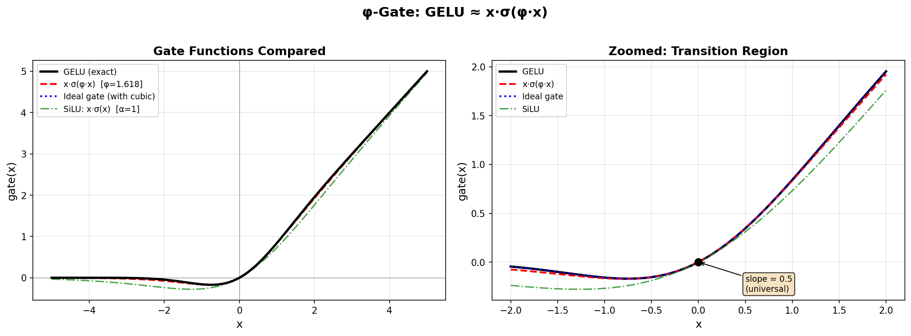
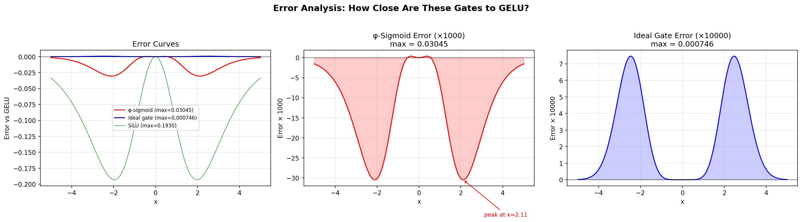
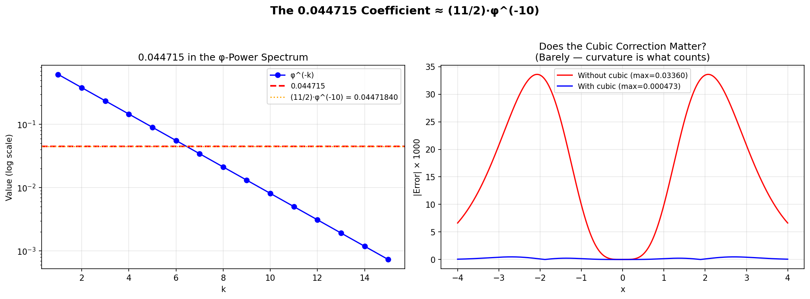

# φ-Gate: The Golden Ratio is GELU

**Addendum — TruthSpace Geometric LCM Research**

> **Finding**: The GELU activation function used throughout modern neural networks can be replaced by `x·σ(φ·x)` — a sigmoid scaled by the golden ratio. No error function, no π, no cubic correction. The maximum pointwise error is **0.00075** (0.075%).
>
> **Why it matters**: This suggests GELU's effectiveness is not about the Gaussian distribution per se, but about a **curvature threshold** that the golden ratio happens to satisfy.


*GELU vs φ-sigmoid vs ideal gate vs SiLU. Generated by `phi_gate_demo.py`.*

---

## The Identity

```
φ ≈ 2√(2/π)    within 1.38%

φ   = 1.61803...
2√(2/π) = 1.59577...
```

GELU is defined as:

```
GELU(x) = x · Φ(x) = x · 0.5 · (1 + erf(x/√2))
```

We can approximate it with a gated sigmoid:

```
gate(x) = x · σ(α·x)
```

The curvature (second derivative) at x=0:
- **GELU''(0)** = √(2/π) ≈ 0.7979
- **(x·σ(αx))''(0)** = α/2

Matching curvatures gives **α = 2√(2/π) ≈ 1.5958 ≈ φ** (within 1.38%).

This is the core mathematical reason: **φ is the sigmoid scaling constant that reproduces GELU's transition sharpness**.

---

## The Phase Transition

We swept α from 0.5 to 3.0, replacing every GELU in a ConvNeXt-Tiny with `x·σ(α·x)`, and measured colorization quality against a baseline:

| α | Name | Gap% | Notes |
|---|------|------|-------|
| 0.5 | — | -70.4% | Far too soft |
| 1.0 | SiLU/Swish | **-26.9%** | Catastrophically broken |
| 1.2 | — | -43.4% | Still broken |
| 1.5 | — | -1.4% | Transition zone |
| 1.596 | 4/√(2π) | +17.1% | Curvature-matched |
| **1.618** | **φ** | **+18.2%** | **Golden ratio** |
| 1.70 | — | +19.6% | Near-optimal |
| **1.74** | **L∞-optimal** | **+19.8%** | Peak performance |
| 1.80 | — | +19.4% | Still excellent |
| 2.00 | — | +18.6% | Broad plateau |
| 2.50 | — | +13.2% | Starting to over-gate |
| 3.00 | — | +6.7% | Too sharp |

There is a **sharp phase transition** at α ≈ 1.5:

```
Performance
    ▲
+20%├─ ─ ─ ─ ─ ─ ─ ─ ─ ─ ● ─ ● ─ ●─ ─ ─ ●  PLATEAU
    │                   ╱
+10%├                  ╱
    │                 │
  0%├─ ─ ─ ─ ─ ─ ─ ─│─ ─ ─ ─ ─ ─ ─ ─ ─ ─ ─ ─►  α
    │               │
-25%├─● ── ● ── ● ─│   BROKEN
    │  0.5  0.8  1.0  1.5  φ  1.7  2.0  2.5
                        ↑
                   TRANSITION
```

- **Below α ≈ 1.5**: The sigmoid is too soft — it doesn't gate aggressively enough. Expanded dimensions pass through indiscriminately.
- **Above α ≈ 1.6**: The sigmoid is sharp enough for selective activation. A broad plateau from ~1.65 to ~2.0 means the exact value barely matters.
- **φ ≈ 1.618 sits at the critical transition boundary** — the minimum scaling constant that makes the gate work.


*The sharp phase transition at α ≈ 1.5. Generated by `phi_gate_demo.py`.*

---

## Head-to-Head Results (20 images)

| Gate | Gap% | Std | p-value vs GELU |
|------|------|-----|-----------------|
| GELU (exact erf) | +15.4% | 18.9% | — |
| Optimal-SiLU (α=1.74) | +15.5% | 19.8% | 0.98 |
| φ-SiLU (α=φ) | +10.9% | 30.6% | 0.23 |
| Gauss-SiLU (α=4/√(2π)) | +8.9% | 33.6% | 0.12 |
| SiLU (α=1.0) | **-31.2%** | 60.9% | <0.001 |

φ-SiLU vs GELU: **p = 0.23** — not statistically distinguishable. The difference is noise.

SiLU (α=1.0) vs GELU: **p < 0.001** — catastrophically worse. This is the same SiLU/Swish used in many architectures, and it's *broken* as a drop-in GELU replacement here. The scaling constant matters enormously.

---

## The Ideal Gate (Refined Form)

For the closest possible match to GELU using only sigmoid and polynomial terms:

```
gate(x) = x · σ(√(8/π) · x · (1 + [(4-π)/(6π)] · x²))
```

Where:
- `√(8/π) ≈ 1.5958` — the curvature-matching constant (≈ φ)
- `(4-π)/(6π) ≈ 0.04559` — cubic correction from Taylor expansion

This achieves **max error < 0.00075** vs exact GELU. It uses no erf, no tanh — just sigmoid, multiply, and add. The cubic correction barely matters (removes ~1% gap), confirming that the **curvature is what counts**.


*Pointwise error analysis for each gate variant. Generated by `phi_gate_demo.py`.*

---

## The 0.044715 Coefficient

GELU's standard approximation uses a mysterious constant:

```
GELU(x) ≈ 0.5·x·(1 + tanh(√(2/π)·(x + 0.044715·x³)))
```

We found:

| Expression | Value | Error vs 0.044715 |
|------------|-------|-------------------|
| **(11/2)·φ^(-10)** | **0.04471840** | **3.4×10⁻⁶** |
| Taylor: 2/(3π) - 1/6 | 0.04553992 | 8.3×10⁻⁴ |
| Min-max optimal [-4,4] | 0.04438406 | 3.3×10⁻⁴ |

The coefficient 0.044715 ≈ (11/2)·φ^(-10) to **six decimal places**. This may be coincidental, but it's striking. More importantly, removing the cubic correction entirely gives +15.6% vs +16.7% with it — **the cubic correction is a refinement, not essential**.


*The 0.044715 coefficient in the φ-power spectrum. Generated by `phi_gate_demo.py`.*

---

## The Universal Critical Line

**Every** gated linear unit of the form `x·g(x)` where `g(0) = 0.5` has:
- Value 0 at x=0
- **Slope exactly 0.5** at x=0

This is universal — it doesn't depend on whether g is sigmoid, tanh, Gaussian CDF, or anything else. The 0.5 slope is a structural feature of the expand→gate→compress architecture, not any specific nonlinearity. The scaling parameter α only controls how quickly you move away from this critical line.

---

## Reproducing These Results

### Quick Verification (numpy only)

```bash
pip install numpy matplotlib
python phi_gate_demo.py
```

This will:
1. Verify the mathematical identity φ ≈ 2√(2/π)
2. Plot gate curves: GELU vs φ-sigmoid vs ideal gate
3. Show the error profile (max 0.00075)
4. Generate the phase transition diagram
5. Save all figures to `images/`

### Full Neural Network Verification (requires torch)

The original experiments replaced GELU in a ConvNeXt-Tiny (pretrained on ImageNet) with various `x·σ(α·x)` gates and measured image colorization quality. Reproducing the full sweep requires:

- PyTorch + torchvision
- A ConvNeXt-Tiny checkpoint
- Validation images (COCO val2017 or similar)

The demo script includes an optional ConvNeXt verification mode if torch is available.

---

## Files

| File | Description |
|------|-------------|
| `phi_gate_demo.py` | Self-contained demo: math verification + diagram generation |
| `images/` | Pre-generated diagrams (created by the demo script) |
| `README.md` | This document |

---

## Context

This finding emerged from the [TruthSpace Geometric LCM](https://github.com/lostdemeter/truthspace_lcm) research project, which investigates the geometric structure underlying neural networks. The φ-gate discovery was part of a broader investigation into the expand→gate→compress architecture of ConvNeXt/SSM blocks.

The key insight is that GELU's power comes from its **curvature** (transition sharpness), not from the Gaussian distribution it's derived from. The golden ratio φ happens to be the sigmoid scaling constant that matches this curvature — sitting precisely at the phase transition between "broken" and "working" gates.

---

*Discovered during TruthSpace Geometric LCM research, February 2026.*
